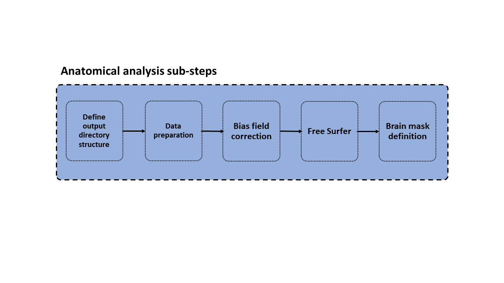

# Anatomical analysis step

The aim of this step is to:

1. Define the cortical surfaces.
2. Defien a surface parcellation.
3. Segment the sub-cortical regions of gray matter.

## Input

The inputs for this step are:

* A t1w image.
* A t2w image (if available).

## Output

* Cortical surfaces (white, pial, mid-thickness).
* Cortical statistics.
* Cortical-segmentation (volumetric) and parcellation (surface).
* Sub-cortical segmentation.
* Intenisty corrected, brain extracted structural images.

# Workflow

The anatomical analysis step is composed of several sub-steps which we describe here in detail.

## Folder structure and input definition

This step has to main functions: first, it creates the folder structure for the specific session under investigation. Second, it defines the inputs fo the next steps based on the data converted at the DICOM to NIfTI conversion step.

### Input

### Output

### QC

## Anatomical data preparation

### Input

### Output

### QC

## Bias field correction

### Input

### Output

### QC

## FreeSurfer analysis

### Input

### Output

### QC

## Brain mask definition

### Input

### Output

### QC

