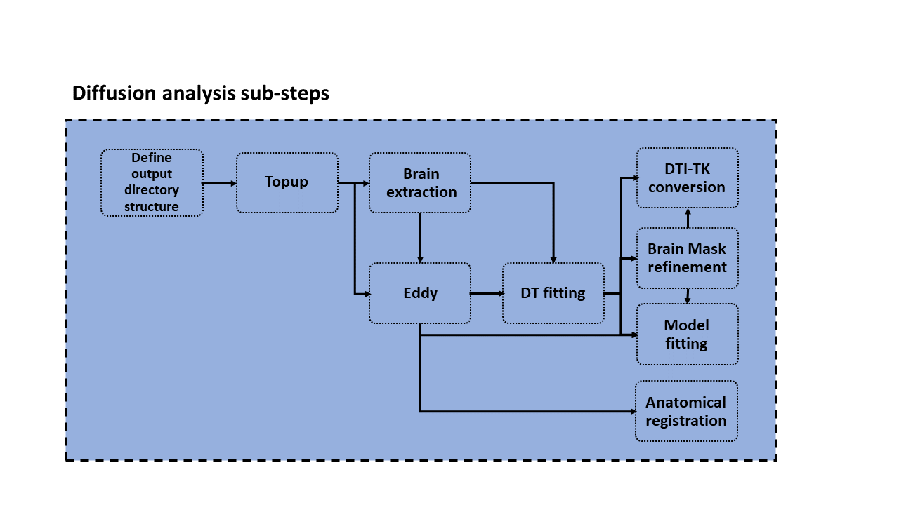

# Diffusion analysis step

The aim of this step is to:

1. ...

## Input

The inputs for this step are:

* ...
* ...

## Output

* ...

# Workflow

The diffusion analysis step is composed of several sub-steps which we describe here in detail.

## Folder structure and input definition

This step has to main functions: first, it creates the folder structure for the specific session under investigation.
Second, it defines the inputs fo the next steps based on the data converted at the DICOM to NIfTI conversion step.

### Input

### Output

### QC

## Topup

### Input

### Output

### QC

## Brain maks extraction

### Input

### Output

### QC

## Eddy

### Input

### Output

### QC

## DTI fit

### Input

### Output

### QC

## Brain mask refinement

### Input

### Output

### QC

## DTI-TK conversion

### Input

### Output

### QC

## NODDI fitting

### Input

### Output

### QC

## Anatomical registration

### Input

### Output

### QC

