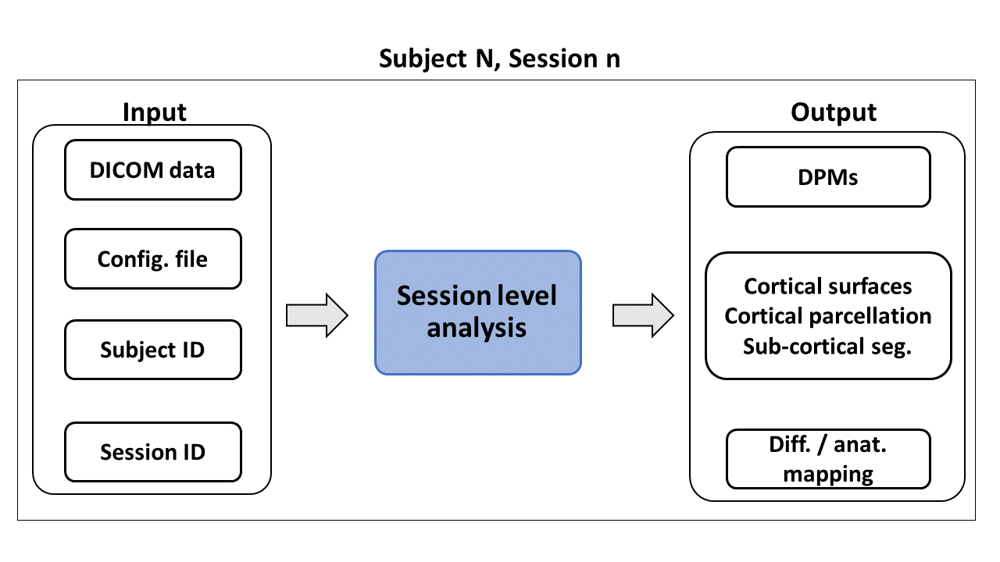
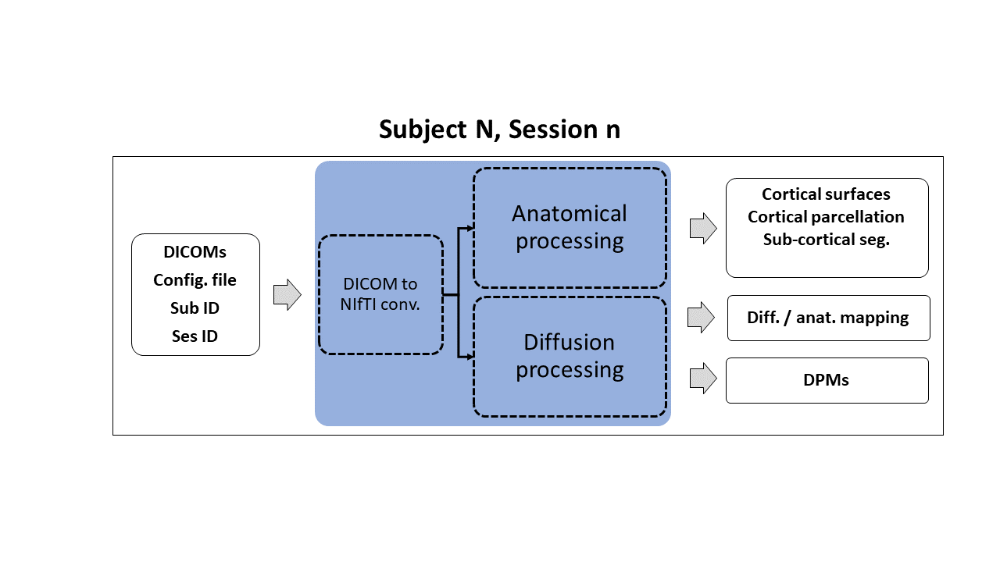

# Session level analysis

This step processes the data from each time point and each subject independently from any other acquisition.
The purpose of this step is to produce all the relevant imaging features which can be extracted from the specific acquisition session.
The obtainable features depend on the data acquired in the session and on the intended analysis to perform (e.g., DTI if only one b-value available; which model to fit; 
freesurfer analysis if a T1w image is available).

## Input

The session level analysis input is the set of images from a specific session. Such data should be in DICOM format. Data in NIfTI format can also be used with [some caveats]().
The main input consists of diffusion MRI data. 
This step can also integrate structural MRI data such as T1w images to improve future steps of the analysis as well to give access to specific streams of the analysis such as cortical surface based analysis.

Other inputs of this step are:

* A configuration file which should follow the criteria specified [here](https://unfmontreal.github.io/Dcm2Bids/docs/3-configuration/). This is used for the DICOM to NIfTI conversion as well as to inform which data MiNPAT should expect.
* A subject ID which will be used to identify the subject from which the data belong. This should be the same for all the other time points which will be processed.
* A session ID which together with the subject ID will uniquely identify the session.

## Outputs

There are different outputs from this stps, some of them depends on the type of data available:

* Diffusion-derived parametric maps (DPMs), such as DTI or NODDI drived maps.
* Cortical surfaces, cortical parcellation, and  sub-cortical segmentation (if anatomical data are available).
* Diffusion to anatomical mapping (if anatomical data are available).

## Workflow

The session level analysis unit can be divided in three steps:

1. [The DICOM to NIfTI conversion](dcm2nii_step.md).
2. [Anatomical data analysis](anat_step.md).
3. [Diffusion data analysis](diff_step.md).

