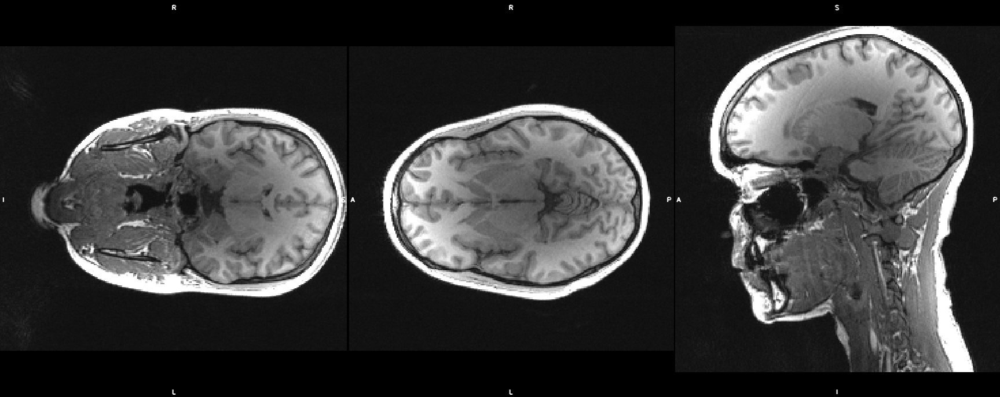
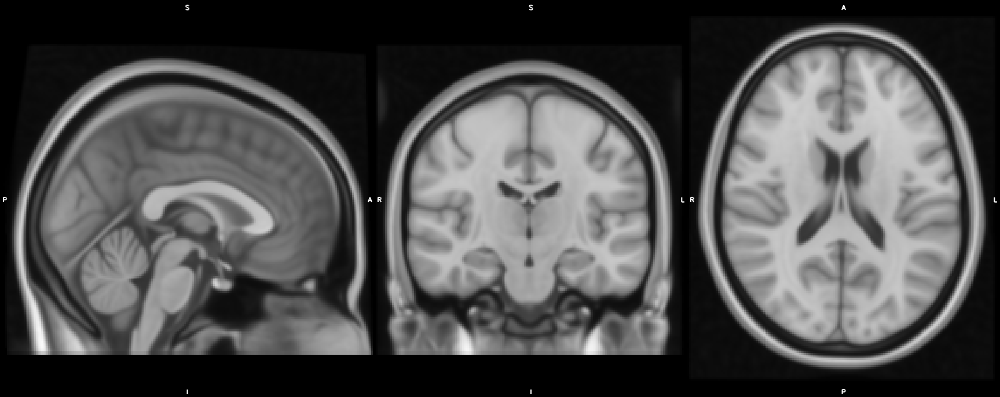

# acpc_align

## Purpose
The aim of this to have structural images correctly visualized and improve robustness of the subsequent analysis.
This involvs three steps:
1. reorienting the input images to match the orientation of the standard template images (MNI152) used in FSL;
1. reducing the FOV  to remove lower head and neck.
1. roughly aligning the images to the template image.

## Problem
Raw structural images often suffer from the following problems:
1. When displayed, they may look wrongly oriented compared to the template images (e.g. using FSLeyes). This is not due to wrong labeling but sinply from different orientations.
2. Thet have big portion of beck and lower head, which may affect the accuracy of preocessing steps such as brain registration or brain extraction.
3. Multiple images from different subjects or multiple acquisition from the same subject can look tilted between each other beacuase of different head position, which may create discomfort in the visulization.

This tool aims to solve all these issues at onece.





## Prerequsites

FSL should be correctly installed

## Usage

### Input
The script takes in input a single structural image (e.g. T1w, T2w, ...).
This is specified via the flag **--in**.
Additionally, the output basename can be provided **--out**.

### Output
Two outputs are generated:
* the reoriented, cropped, and aligned image.
* the transformation which brings from the input to the output image.

The outputs are specified adding the suffix *_acpc* to the input basename if the --out flag is not used.
Otherwise, they add the same suffix to the specified basename.

The script also create a folder named "ACPCtmp", in which to store intermediate files

### Optional inputs
* The reorientation step can be skipped by adding the **--noReorient** flag.
* The neck and lower head cropping can be skipped by adding the **--noCrop** flag.
* An alternative template can be used via the **--std** flag.

## Example usage

```bash
acpc_align --in=<path_to_struct_map>
```

```bash
acpc_align --in=<path_to_struct_map> --out=<path_to_output+base_name>
```

```bash
acpc_align --in=<path_to_struct_map> --out=<path_to_output+base_name> --noReorient --noCrop --std=<path_to_template>
```
